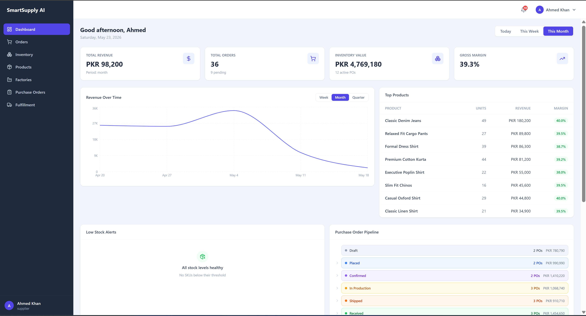

<div align="center">

# SmartSupply AI

### AI-powered supply chain and order management platform for apparel businesses — with Gemini-powered Text-to-SQL business intelligence assistant

<br/>

[](https://python.org)
[](https://fastapi.tiangolo.com)
[](https://react.dev)
[](https://typescriptlang.org)
[](https://postgresql.org)
[](https://docker.com)
[](https://github.com/SajidAli8015/smartsupply-ai/actions)
[](LICENSE)

</div>

---

## Overview

SmartSupply AI is a full-stack, production-ready supply chain management platform built specifically for apparel businesses. It covers the complete business cycle — from factory procurement and inventory management, through to customer orders, warehouse fulfillment, and delivery — in a single cohesive system. The platform is designed for small-to-medium apparel suppliers who need real operational visibility without the cost or complexity of enterprise ERP software.

The platform includes a fully functional AI business intelligence assistant powered by Google Gemini. It uses a Text-to-SQL approach — converting natural language questions into PostgreSQL queries, executing them against live business data, and returning plain English insights. The assistant supports multi-turn conversations with memory, so follow-up questions like *"How can I reorder it?"* understand the previous context automatically. Every response shows the generated SQL query and raw data for full transparency.

SmartSupply AI serves three personas: **suppliers** (owners and managers who need business KPIs, purchase order management, and full order visibility), **warehouse staff** (who need a clean, focused queue for packing and shipping), and **buyers** (retail customers who browse products, place orders, and track deliveries). Role-based access control ensures each user sees only what is relevant to their workflow, with separate layouts, navigation, and API guards per role.

The technical foundation is a FastAPI backend with a service-layer architecture, a React 18 frontend with a fully typed Axios client, PostgreSQL for persistence, Redis for background task queuing, and Docker for local development parity. The CI/CD pipeline runs on GitHub Actions, validating both the Python test suite and the TypeScript build on every push.

---

## Screenshots

<br/>

**Supplier Dashboard** — Live KPIs, revenue time-series chart, top products by revenue, and purchase order pipeline



---

## AI Business Intelligence Assistant

SmartSupply AI includes a fully functional AI assistant that gives suppliers natural language access to their business data.

### How it works

1. Supplier asks a question in plain English
2. Gemini generates a PostgreSQL `SELECT` query based on the question and the full database schema
3. Query executes against live business data (read-only, safety validated — only `SELECT`/`WITH` allowed)
4. Results are injected back into Gemini as context for a second turn
5. Gemini returns a plain English business insight formatted for a business analyst
6. Full conversation history (last 10 messages) is sent with every request for multi-turn continuity

### Example conversations

| Question | What the AI does |
|---|---|
| *"Which products should I reorder this week?"* | Queries inventory against low-stock thresholds, returns SKUs with exact quantities needed |
| *"How can I reorder it?"* | Remembers the context — explains PO creation steps with the relevant SKU codes |
| *"What was my revenue this month?"* | Queries the orders table, aggregates `total_amount` for confirmed/delivered orders, returns PKR totals |
| *"Which orders are still unshipped?"* | Lists orders with `shipped` status pending, including buyer names and order ages |
| *"Who are my top customers?"* | Ranks buyers by total spend with order counts |

### Technical implementation

| Aspect | Detail |
|---|---|
| **LLM** | Google Gemini 2.5 Flash |
| **Approach** | Text-to-SQL (structured data — no vector embeddings needed) |
| **Memory** | Last 10 messages sent with every request for conversation continuity |
| **Safety** | SQL validated before execution — only `SELECT`/`WITH` allowed; forbidden keywords blocked |
| **Row cap** | Queries automatically capped at 100 rows to prevent accidental full-table scans |
| **Storage** | Chat sessions and messages persisted in PostgreSQL (`chat_sessions`, `chat_messages`) |
| **Access** | Supplier role only — protected at both the FastAPI dependency and React route levels |

---

## Features

### Supplier / Owner

- **Real-time business dashboard** with revenue KPIs, total orders, inventory value, and gross margin — all calculated live from the database
- **Sales analytics** with time-series revenue charts across daily, weekly, and monthly windows, powered by Recharts
- **Top products and slow-mover identification** — ranked by revenue to surface what's working and what isn't
- **Purchase order management** — create POs against factory vendors, track line items, and monitor fulfillment from `draft` → `sent` → `confirmed` → `in_production` → `shipped` → `received`
- **Inventory tracking** with SKU-level stock quantities, low-stock threshold alerts, and available vs. reserved breakdown
- **Full order visibility** — view every buyer order with status history, item breakdown, shipping address, and shipment tracking numbers
- **Order lifecycle management** — confirm pending orders and mark shipped orders as delivered directly from the order detail view
- **Notifications system** — in-app notification feed for restocks, order events, and business alerts
- **AI business intelligence assistant** — natural language queries powered by Google Gemini; ask questions, get answers backed by live database data
- **Text-to-SQL engine** — plain English questions are converted to PostgreSQL queries and executed against live data in real time
- **Multi-turn conversation memory** — follow-up questions understand previous context; last 10 messages sent with every request
- **Transparent AI responses** — every answer shows the generated SQL query and raw result data in collapsible panels
- **Suggested questions and quick actions** — pre-built prompts for reorder suggestions, slow-mover analysis, and revenue summaries
- **Full chat history with session management** — conversations persisted in PostgreSQL, accessible from a left-panel session list
- **Business snapshot panel** — live KPIs (today's orders, low-stock count, active POs) displayed alongside every chat

### Warehouse Staff

- **Fulfillment queue** split into two focused columns: *To Pack* (confirmed orders awaiting packaging) and *To Ship* (packed orders awaiting dispatch)
- **Priority flagging** — orders older than 24 hours are automatically surfaced with a red priority badge so nothing sits forgotten
- **One-click pack workflow** — mark an order as packed with a single button; the queue updates instantly
- **Ship modal** — enter carrier (TCS, Leopards, PostEx, DHL) and tracking number to create a shipment record and advance the order to `shipped`
- **Auto-refreshing queue** — polls every 60 seconds so warehouse staff always see the current state without manual page refreshes

### Buyers

- **Product storefront** with server-side pagination and client-side filtering by product type, size, color, and price range
- **Debounced search** across product names and descriptions — smooth, no excessive API calls
- **SKU-level selection** — interactive color swatches and size buttons that reflect real-time inventory availability per variant
- **Stock indicators** — *In Stock*, *Low Stock*, *Only N left!*, and *Out of Stock* badges driven by live inventory data
- **Cart sidebar** with localStorage persistence, quantity controls, and item removal — survives page refreshes and navigation
- **Checkout** with shipping address form, client-side validation, and a live order summary panel
- **Order confirmation page** with full order details immediately after placement
- **Order tracking** — expandable order cards showing status badge, item breakdown, shipping address, and courier tracking number
- **Order cancellation** available for `pending` and `confirmed` orders directly from the buyer's order history

---

## Tech Stack

| Layer | Technology |
|---|---|
| **Frontend** | React 18, TypeScript 5, Tailwind CSS, React Query v5, React Router v6, Recharts |
| **Backend** | FastAPI 0.111, SQLAlchemy 2.0, Alembic, Pydantic v2, Celery |
| **Database** | PostgreSQL 16, Redis 7 |
| **Auth** | JWT (python-jose), bcrypt (passlib), httpOnly refresh cookie |
| **Infrastructure** | Docker, Docker Compose, GitHub Actions CI/CD |
| **Cloud Ready** | AWS ECS, RDS, S3, CloudFront *(deployment guide coming)* |
| **Payments** | Stripe SDK *(test mode integration)* |
| **AI / LLM** | Google Gemini 2.5 Flash, Text-to-SQL, Multi-turn conversation memory |

---

## Architecture

SmartSupply AI follows a clean **monorepo** structure with `/backend`, `/frontend`, `/infra`, and `/docs` as first-class directories — each independently buildable and deployable.

The **FastAPI backend** uses a strict three-layer architecture: **routers** handle HTTP concerns (request parsing, auth guards, response serialization), **services** contain all business logic and database access, and **SQLAlchemy models** define the persistence schema. This keeps route handlers thin and business logic fully testable without HTTP overhead. Pydantic v2 models are used for all request validation and response serialization, with `model_validator(mode="before")` hooks for complex transformations.

The **React frontend** separates server state from UI state cleanly. **React Query** manages all API data with configurable `staleTime` per query — real-time views (like the fulfillment queue) poll aggressively, while stable data (product catalog) is cached for several minutes. **React Context** handles auth state and the shopping cart, with the cart persisted to `localStorage` so it survives navigation and refresh. The routing tree uses **nested protected routes** where `ProtectedRoute` checks role before rendering the layout, which renders the active page via `<Outlet />`. The buyer shell wraps the entire buyer layout in `CartProvider`, making cart state available in both the navbar badge and the slide-over sidebar without prop drilling.

**Role-based access control** is enforced at both layers: FastAPI `Depends()` guards decode the JWT and check role before any route handler executes, and `ProtectedRoute` on the frontend prevents unauthorized navigation. The three roles — `supplier`, `staff`, and `buyer` — each get a distinct layout, navigation structure, and set of API-accessible endpoints.

**PostgreSQL with Alembic** manages all schema changes through versioned migrations. The seed script (`scripts/seed.py`) is fully idempotent and generates a realistic Pakistani apparel business dataset — products, SKUs, inventory, factories, purchase orders, and 60+ days of order history — making it possible to demo every feature immediately after setup.

---

## Project Structure

```
smartsupply-ai/
├── .github/
│   └── workflows/
│       └── ci.yml                    # GitHub Actions CI/CD pipeline
├── backend/
│   ├── alembic/                      # Database migrations
│   │   └── versions/                 # Migration files
│   ├── core/
│   │   ├── config.py                 # App settings from .env
│   │   ├── dependencies.py           # FastAPI role-based dependencies
│   │   └── security.py               # JWT and password hashing
│   ├── db/
│   │   ├── base.py                   # SQLAlchemy declarative base
│   │   └── session.py                # Database engine and get_db
│   ├── models/
│   │   ├── user.py                   # User model (supplier/staff/buyer)
│   │   ├── product.py                # Product and SKU models
│   │   ├── inventory.py              # Inventory model
│   │   ├── factory.py                # Factory/vendor model
│   │   ├── purchase_order.py         # PO and PO line items
│   │   ├── order.py                  # Order, order items, shipment
│   │   ├── notification.py           # Notifications model
│   │   └── chat.py                   # AI chat sessions and messages
│   ├── routers/
│   │   ├── auth.py                   # Login, register, refresh, logout
│   │   ├── products.py               # Product and SKU endpoints
│   │   ├── inventory.py              # Inventory and stock adjustment
│   │   ├── factories.py              # Factory CRUD
│   │   ├── purchase_orders.py        # PO management and receiving
│   │   ├── orders.py                 # Order lifecycle management
│   │   ├── analytics.py              # Dashboard KPIs and charts data
│   │   ├── notifications.py          # Notification endpoints
│   │   └── ai.py                     # AI chat sessions and messages
│   ├── schemas/
│   │   ├── auth.py                   # Login/register request/response
│   │   ├── product.py                # Product and SKU schemas
│   │   ├── inventory.py              # Inventory schemas
│   │   ├── factory.py                # Factory schemas
│   │   ├── purchase_order.py         # PO schemas
│   │   ├── order.py                  # Order schemas
│   │   └── notification.py           # Notification schemas
│   ├── services/
│   │   ├── product_service.py        # Product business logic
│   │   ├── inventory_service.py      # Inventory business logic
│   │   ├── factory_service.py        # Factory business logic
│   │   ├── po_service.py             # Purchase order business logic
│   │   ├── order_service.py          # Order and fulfillment logic
│   │   ├── notification_service.py   # Notification creation
│   │   └── ai_service.py             # Gemini AI, text-to-SQL, chat memory
│   ├── scripts/
│   │   └── seed.py                   # Realistic Pakistani apparel seed data
│   ├── tests/
│   │   ├── test_health.py            # Health check smoke test
│   │   ├── test_auth.py              # Auth endpoint tests
│   │   └── test_products.py          # Products and inventory tests
│   ├── main.py                       # FastAPI app factory
│   ├── alembic.ini                   # Alembic configuration
│   └── requirements.txt              # Python dependencies
├── frontend/
│   └── src/
│       ├── api/
│       │   ├── client.ts             # Axios instance with auth interceptor
│       │   ├── analytics.ts          # Analytics and KPI API calls
│       │   ├── products.ts           # Products and inventory API calls
│       │   ├── factories.ts          # Factories API calls
│       │   ├── purchase_orders.ts    # Purchase orders API calls
│       │   ├── orders.ts             # Orders API calls
│       │   ├── buyer.ts              # Buyer storefront API calls
│       │   └── ai.ts                 # AI assistant API calls
│       ├── components/
│       │   ├── dashboard/            # KPI cards, charts, pipeline
│       │   │   ├── KPICard.tsx
│       │   │   ├── SalesChart.tsx
│       │   │   ├── TopProductsTable.tsx
│       │   │   ├── LowStockAlert.tsx
│       │   │   └── POPipeline.tsx
│       │   ├── buyer/                # Cart sidebar
│       │   │   └── CartSidebar.tsx
│       │   └── ProtectedRoute.tsx    # Role-based route guard
│       ├── contexts/
│       │   ├── AuthContext.tsx        # JWT auth state management
│       │   └── CartContext.tsx        # Shopping cart with localStorage
│       ├── layouts/
│       │   ├── SupplierLayout.tsx     # Sidebar layout for supplier/staff
│       │   └── BuyerLayout.tsx        # Top nav layout for buyers
│       ├── pages/
│       │   ├── auth/
│       │   │   ├── Login.tsx
│       │   │   └── Register.tsx
│       │   ├── supplier/
│       │   │   ├── Dashboard.tsx      # KPIs, charts, AI widget
│       │   │   ├── Orders.tsx         # Order management
│       │   │   ├── Inventory.tsx      # Stock management
│       │   │   ├── Products.tsx       # Product catalog
│       │   │   ├── Factories.tsx      # Factory vendors
│       │   │   ├── PurchaseOrders.tsx # PO management
│       │   │   ├── Fulfillment.tsx    # Pack and ship queue
│       │   │   └── AIChat.tsx         # Gemini AI assistant
│       │   ├── buyer/
│       │   │   ├── Shop.tsx           # Product storefront
│       │   │   ├── ProductDetail.tsx  # SKU selector and cart
│       │   │   ├── Checkout.tsx       # Order placement
│       │   │   ├── OrderConfirmation.tsx
│       │   │   └── MyOrders.tsx       # Order tracking
│       │   └── Unauthorized.tsx
│       ├── types/
│       │   └── index.ts              # TypeScript interfaces
│       └── App.tsx                   # Router and route definitions
├── docs/
│   └── screenshots/                  # App screenshots for README
├── infra/                            # AWS Terraform (coming soon)
├── docker-compose.yml                # Full stack Docker setup
├── docker-compose.dev.yml            # Dev setup (PostgreSQL only)
└── .env.example                      # Environment variables template
```

---

## Local Development

### Prerequisites

- [Docker Desktop](https://www.docker.com/products/docker-desktop/) — for the PostgreSQL container
- Python 3.11
- Node.js 20+

### Setup

```bash
# 1. Clone the repository
git clone https://github.com/SajidAli8015/smartsupply-ai.git
cd smartsupply-ai

# 2. Copy environment template
cp .env.example .env
# Review .env — defaults work out of the box for local development
```

**Backend** (Terminal 1):

```bash
cd backend

# Create and activate virtual environment
py -3.11 -m venv .venv

# Windows
.venv\Scripts\activate
# macOS / Linux
source .venv/bin/activate

# Install Python dependencies
pip install -r requirements.txt

# Start PostgreSQL in Docker (database only — backend runs natively)
cd ..
docker-compose -f docker-compose.dev.yml up -d
cd backend

# Apply database migrations
alembic upgrade head

# Seed with realistic demo data (idempotent — safe to run multiple times)
python scripts/seed.py

# Start the API server
uvicorn main:app --reload
# API:        http://localhost:8000
# Swagger UI: http://localhost:8000/docs
# ReDoc:      http://localhost:8000/redoc
```

**Frontend** (Terminal 2):

```bash
cd frontend
npm install
npm run dev
# App: http://localhost:3000
```

### Full Stack with Docker

To run the complete stack (PostgreSQL + Redis + backend + frontend) entirely in Docker:

```bash
cp .env.example .env
docker-compose up --build
# App: http://localhost:3000
# API: http://localhost:8000
```

---

## Demo Credentials

Run `python scripts/seed.py` from the `backend/` directory to populate the database. All seeded accounts share the same password: **`Admin123!`**

| Role | Email | Password |
|---|---|---|
| **Supplier** | `supplier@smartsupply.com` | `Admin123!` |
| **Staff** | `usman.tariq@smartsupply.com` | `Admin123!` |
| **Staff** | `fatima.malik@smartsupply.com` | `Admin123!` |
| **Buyer** | `ali.raza@gmail.com` | `Admin123!` |
| **Buyer** | Register a new account at `/register` | — |

> The seed script generates 20 buyer accounts, 8 products with multiple color/size SKUs, 5 factory vendors, 30+ purchase orders, and 60+ days of order history — enough data to explore every feature immediately.

> **AI Assistant** is available to the Supplier role only at `/ai-assistant`. Requires a valid `GEMINI_API_KEY` in `.env` — get a free key from [Google AI Studio](https://aistudio.google.com/app/apikey).

---

## API Documentation

The FastAPI backend auto-generates interactive documentation directly from the OpenAPI schema. No separate documentation setup required.

| Interface | URL |
|---|---|
| **Swagger UI** (interactive) | http://localhost:8000/docs |
| **ReDoc** (readable) | http://localhost:8000/redoc |
| **OpenAPI JSON** | http://localhost:8000/openapi.json |

All endpoints are versioned under `/api/v1/` and follow RESTful conventions. Authenticated endpoints require an `Authorization: Bearer <token>` header obtained from `POST /api/v1/auth/login`.

| Group | Base Path | Description |
|---|---|---|
| Auth | `/api/v1/auth` | Login, token refresh, logout |
| Products | `/api/v1/products` | Paginated catalog with filters |
| Orders | `/api/v1/orders` | Order CRUD, status updates, fulfillment queue |
| Inventory | `/api/v1/inventory` | Stock levels and low-stock alerts |
| Factories | `/api/v1/factories` | Factory vendor management |
| Purchase Orders | `/api/v1/purchase-orders` | PO lifecycle management |
| Analytics | `/api/v1/analytics` | KPIs, revenue charts, top products |
| Notifications | `/api/v1/notifications` | In-app notification feed |
| AI Assistant | `/api/v1/ai` | Chat sessions, message history, Gemini Text-to-SQL |
| Health | `/api/v1/health` | Liveness probe for load balancers |

---

## Environment Variables

Copy `.env.example` to `.env`. All variables with defaults work out of the box for local development.

| Variable | Required | Default | Description |
|---|---|---|---|
| `DATABASE_URL` | **Yes** | `postgresql://smartsupply:smartsupply123`<br>`@localhost:5432/smartsupply_db` | PostgreSQL connection string |
| `SECRET_KEY` | **Yes** | `changeme` | JWT signing secret — use a long random string in production |
| `ALGORITHM` | No | `HS256` | JWT signing algorithm |
| `ACCESS_TOKEN_EXPIRE_MINUTES` | No | `1440` | Access token lifetime (24 hours) |
| `REDIS_URL` | No | *(unset)* | Redis connection string — Celery background tasks are disabled if unset |
| `GEMINI_API_KEY` | No | *(empty)* | Google Gemini API key — AI Assistant is disabled if unset. Get one free from [Google AI Studio](https://aistudio.google.com/app/apikey) |
| `ALLOWED_ORIGINS` | No | `["http://localhost:3000"]` | CORS allowed origins |
| `STRIPE_SECRET_KEY` | No | *(empty)* | Stripe secret key for payment processing |
| `SENDGRID_API_KEY` | No | *(empty)* | SendGrid API key for transactional email |
| `AWS_ACCESS_KEY_ID` | No | *(empty)* | AWS credentials for S3 file uploads |
| `AWS_SECRET_ACCESS_KEY` | No | *(empty)* | AWS secret key |
| `AWS_REGION` | No | `us-east-1` | AWS region |
| `AWS_S3_BUCKET` | No | *(empty)* | S3 bucket name for product image uploads |

> **Security note:** Never commit your `.env` file — it is listed in `.gitignore`. For production deployments, use a secrets manager (AWS Secrets Manager, GitHub Actions encrypted secrets, etc.) rather than committing credentials.

---

## Running Tests

```bash
# Backend test suite
cd backend
pytest tests/ -v

# Frontend type-check and production build
cd frontend
npm run build
```

The GitHub Actions CI pipeline runs both jobs on every push to any branch and on every pull request targeting `main`. A green CI badge means the full test suite passes and the TypeScript build is error-free.

---

## Roadmap

- [x] Core supply chain management — products, SKUs, inventory, factories, purchase orders
- [x] Role-based access control — supplier / staff / buyer with JWT auth
- [x] Supplier analytics dashboard — KPIs, revenue charts, top products, PO pipeline
- [x] Buyer storefront — browsing, SKU selection, cart, checkout, order tracking
- [x] Fulfillment queue — warehouse pack and ship workflow with courier integration
- [x] **AI business intelligence assistant** — Text-to-SQL with Google Gemini, multi-turn memory, session history
- [ ] AWS deployment with Terraform — ECS + RDS + S3 + CloudFront
- [ ] Transactional email via SendGrid — order confirmations, status updates
- [ ] WhatsApp order notifications via Twilio
- [ ] Mobile-first responsive optimization
- [ ] Product image uploads to S3
- [ ] Multi-tenant support — multiple independent businesses on one instance
- [ ] Advanced reporting and data export (CSV, PDF)

---


## License

[MIT](LICENSE) — free to use, modify, and distribute with attribution.

---

<div align="center">

Built with FastAPI, React, and PostgreSQL &nbsp;·&nbsp; Designed for Pakistani apparel businesses

</div>
